# PSOC&trade; Edge MCU: Machine learning - face ID demo

This code example showcases Infineon’s comprehensive real-time Face ID solution on the PSOC&trade; Edge MCU, interfacing with a USB camera and a 4.3-inch MIPI DSI display to support on-device face enrolment and recognition; it highlights detected human faces by drawing bounding boxes and overlaying either the enrolled user ID or “unknown” text in case of non-enrolled users on the live video stream at 30 frames per second (FPS), while simultaneously displaying all FaceID model prediction scores on the display with model inference running at approximately 30 FPS.

This code example has a three project structure: CM33 secure, CM33 non-secure, and CM55 projects. All three projects are programmed to the external QSPI flash and executed in Execute in Place (XIP) mode. Extended boot launches the CM33 secure project from a fixed location in the external flash, which then configures the protection settings and launches the CM33 non-secure application. Additionally, CM33 non-secure application enables CM55 CPU and launches the CM55 application. The CM55 application implements the logic for handling the USB webcam, VGLite graphics and FaceID inference.

This code example supports following MIPI DSI display and USB cameras:

- **[Waveshare 4.3-inch Raspberry Pi DSI LCD Display](https://www.waveshare.com/4.3inch-dsi-lcd.htm)**
- **[HBVCAM OV7675 0.3MP Camera](https://www.hbvcamera.com/0-3mp-pixel-usb-cameras/hbvcam-ov7675-0.3mp-mini-laptop-camera-module.html)**
- **[HBVCAM OS02F10 2MP Camera](https://www.hbvcamera.com/2-mega-pixel-usb-cameras/2mp-1080p-auto-focus-hd-usb-camera-module-for-atm-machine.html)**
- **[Logitech C920 HD Pro Webcam](https://www.logitech.com/en-ch/shop/p/c920-pro-hd-webcam)**

> **Note:** Although model inference runs at ~30 FPS, the overall application runs at ~10 FPS due to memory constraints on PSOC&trade;Edge E84 MCU.

[View this README on GitHub.](https://github.com/Infineon/mtb-example-psoc-edge-ml-face-id)

[Provide feedback on this code example.](https://cypress.co1.qualtrics.com/jfe/form/SV_1NTns53sK2yiljn?Q_EED=eyJVbmlxdWUgRG9jIElkIjoiQ0UyNDIxODciLCJTcGVjIE51bWJlciI6IjAwMi00MjE4NyIsIkRvYyBUaXRsZSI6IlBTT0MmdHJhZGU7IEVkZ2UgTUNVOiBNYWNoaW5lIGxlYXJuaW5nIC0gZmFjZSBJRCBkZW1vIiwicmlkIjoibWFqdW1kYXIiLCJEb2MgdmVyc2lvbiI6IjEuMC4wIiwiRG9jIExhbmd1YWdlIjoiRW5nbGlzaCIsIkRvYyBEaXZpc2lvbiI6Ik1DRCIsIkRvYyBCVSI6IklDVyIsIkRvYyBGYW1pbHkiOiJQU09DIn0=)

See the [Design and implementation](docs/design_and_implementation.md) for the functional description of this code example.

## Requirements

- [ModusToolbox&trade;](https://www.infineon.com/modustoolbox) v3.6 or later (tested with v3.6)
- Board support package (BSP) minimum required version: 1.1.0
- Programming language: C
- Associated parts: All [PSOC&trade; Edge MCU](https://www.infineon.com/products/microcontroller/32-bit-psoc-arm-cortex/32-bit-psoc-edge-arm) parts

## Supported toolchains (make variable 'TOOLCHAIN')

- GNU Arm&reg; Embedded Compiler v14.2.1 (`GCC_ARM`) – Default value of `TOOLCHAIN`

> **Note:** This code example may fail to build in RELEASE mode for GCC_ARM Compiler as the version of the `GCC_ARM` toolchain supported in ModusToolbox&trade; does not recognize a few of the Helium instructions of CMSIS-DSP library.

## Supported kits (make variable 'TARGET')

- [PSOC&trade; Edge E84 Evaluation Kit](https://www.infineon.com/KIT_PSE84_EVAL) (`KIT_PSE84_EVAL_EPC2`) – Default value of `TARGET`
- [PSOC&trade; Edge E84 Evaluation Kit](https://www.infineon.com/KIT_PSE84_EVAL) (`KIT_PSE84_EVAL_EPC4`)
- [PSOC&trade; Edge E84 AI Kit](https://www.infineon.com/KIT_PSE84_AI) (`KIT_PSE84_AI`)

## Hardware setup

This example uses the board's default configuration. See the kit user guide to ensure that the board is configured correctly.

Ensure the following jumper and pin configuration on board.
- BOOT SW must be in the HIGH/ON position
- J20 and J21 must be in the tristate/not connected (NC) position

> **Note:** This hardware setup is not required for the KIT_PSE84_AI kit.

### Supported display and electrical connection with KIT_PSE84_EVAL and KIT_PSE84_AI

1. **Waveshare 4.3 inch Raspberry Pi DSI 800*480 pixel display:** This display is supported by default  

   Connect the FPC 15-pin cable between the display connector and the PSOC&trade; Edge E84's RPI MIPI DSI connector as shown in **Table 1** and **Figure 1**  

   **Table 1: PSOC&trade; Edge E84 Kit connections**

   Kit's name                                      | DSI connector
   ------------------------------------------------|----------------------------------------
   PSOC&trade; Edge E84 Evaluation Kit             | J39
   PSOC&trade; Edge E84 AI Kit                     | J10

   Kit's name                                      | USB camera's connector
   ------------------------------------------------|-------------------------
   PSOC&trade; Edge E84 Evaluation Kit             | J27
   PSOC&trade; Edge E84 AI Kit                     | J2

> **Note:** The USB Host on KIT_PSE84_AI is a Type-C connector. So, a Type-A to Type-C converter is required to connect the USB camera.

   **Figure 1.  Display connection with PSOC&trade; Edge E84 evaluation kit**

   

 

## Software setup

See the [ModusToolbox&trade; tools package installation guide](https://www.infineon.com/ModusToolboxInstallguide) for information about installing and configuring the tools package.

Install a terminal emulator if you do not have one. Instructions in this document use [Tera Term](https://teratermproject.github.io/index-en.html).

This example requires no additional software or tools.

## Application Specific Configurations

The following defines can be modified in the proj_cm55/Makefile based on the user application

**Table 2. Application Specific Defines**

Project | Description
--------|------------------------
CAMERA_WIDTH | Camera width dimension
CAMERA_HEIGHT | Camera height dimension
IMAGE_WIDTH | Model input width dimension
IMAGE_HEIGHT | Model input height dimension
ENABLE_FACEID_MODEL_PROFILE | Enables model inference times to be printed over UART (includes pre and post processing times)
DRAW_HEAD_POSE_AXES | Draw head pose axes
DRAW_FACIAL_LANDMARKS | Draw facial landmarks
PLOT_ALIGNED_FACES | Plot aligned faces for debug purposes
NUM_POSES | Set number of enrolment poses. It can be set to 3, 5 and 9 poses. Default value is 5

## Operation

See [Using the code example](docs/using_the_code_example.md) for instructions on creating a project, opening it in various supported IDEs, and performing tasks, such as building, programming, and debugging the application within the respective IDEs.

1. Ensure that the 4.3-inch Raspberry-Pi TFT display and USB camera is connected to the board as per the [Display setup](#supported-display-and-electrical-connection-with-kit_pse84_eval-and-kit_pse84_ai) section

2. Connect the board to your PC using the provided USB cable through the KitProg3 USB connector

3. Open a terminal program and select the KitProg3 COM port. Set the serial port parameters to 8N1 and 115200 baud

4. Build the application

5. After programming, the application starts automatically. Verify that the UART terminal displays the output as shown in the attached image

   **Figure 2. Terminal output on program startup**

   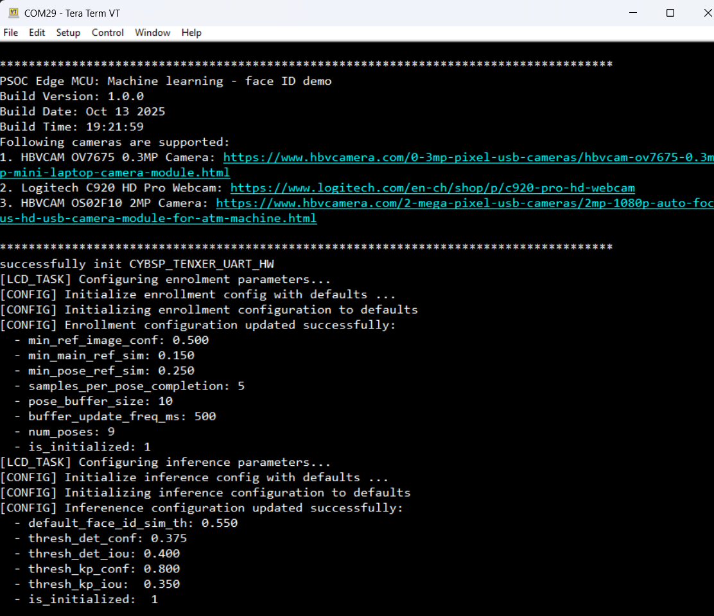
   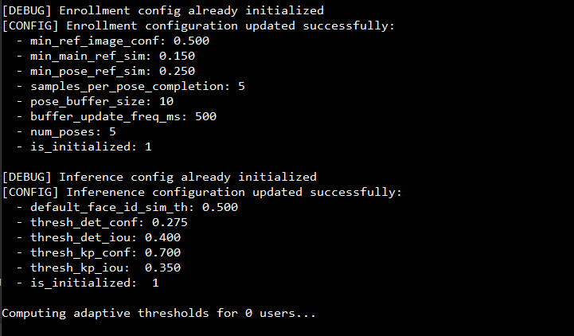

6. Once the application is successfully programmed, the LCD displays the live camera feed along with the following on-device enrolment touch controls and key information:

   - **Bottom Left Corner:** Three action buttons – **Start Face Enrolment**, **Cancel Face Enrolment**, and **Clear Enrolled Users**.
   - **Bottom Right Corner:**  **Model <time>** indicating FaceID mode ML inferencing time in miliseconds.
   - **Upper Panel:**
     - **Left:** Current mode (**INFERENCE MODE/ENROLMENT MODE**).
     - **Center:** Number of enrolled users (initially **0/5** when no user is enrolled).
   - **Face Detection Status:** If no user is enrolled, the detected face appears in a red box with the label **Unknown**.

   **Figure 3. Display output after programming**

   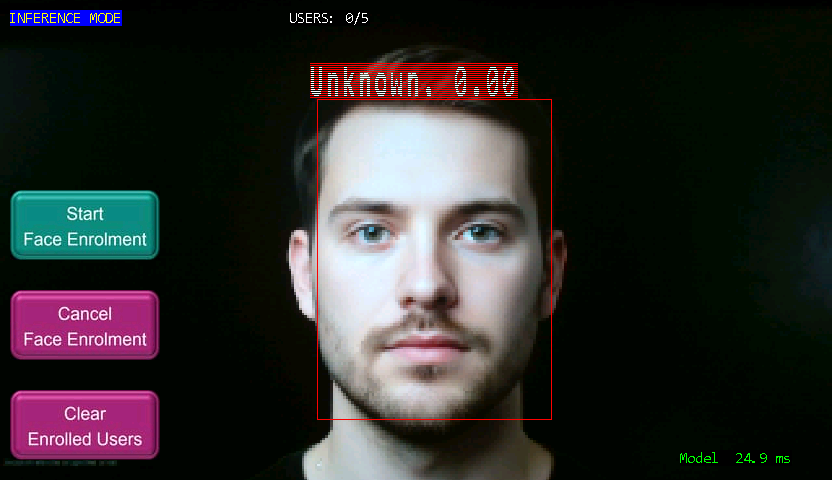

7. Upon clicking the "Start Face Enrolment" button on the display, the on-device face enrolment process begins, and the application mode transitions from **INFERENCE** to **ENROLMENT MODE**.

8. Once a face is properly detected, **green** bounding box appears around the user’s face with the status **“Enrolling”** displayed in green. The **head pose progress** is shown in the bottom right corner using a color-coded legend: **orange** for not started, **pink** for in progress, and **green** for completed. Initially, all poses (Up, Down, Front, Left, Right) are orange, and the status shows Collecting poses and  **“Progress : 0 completed, 0 in progress”**. As poses are captured, the corresponding boxes turn pink and the status updates accordingly (e.g., if Up, Front, and down poses are in progress and box color becomes pink, the status shows **0 completed, 3 in progress**). When a pose is successfully completed, its box turns green and the status updates (e.g., **1 completed, 2 in progress**) and similarly all the angle should be completed.

   **Figure 4. initial image of face enrolment page**

   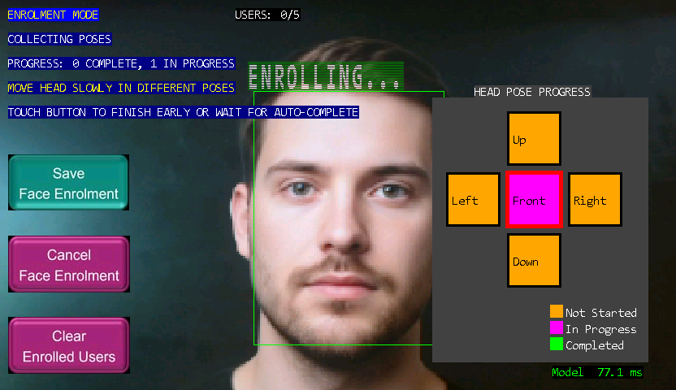

   **Figure 5. Scenario 1 : Progress: 1 completed, 0 in progress**

   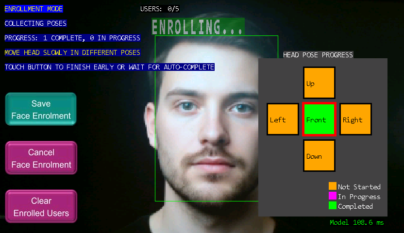

   **Figure 6. Scenario 2 : Progress: 1 completed, 1 in progress**

   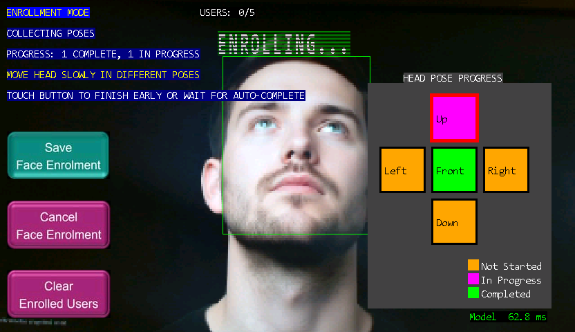

   **Figure 7. Scenario 3 : Progress: 2 completed, 0 in progress**

   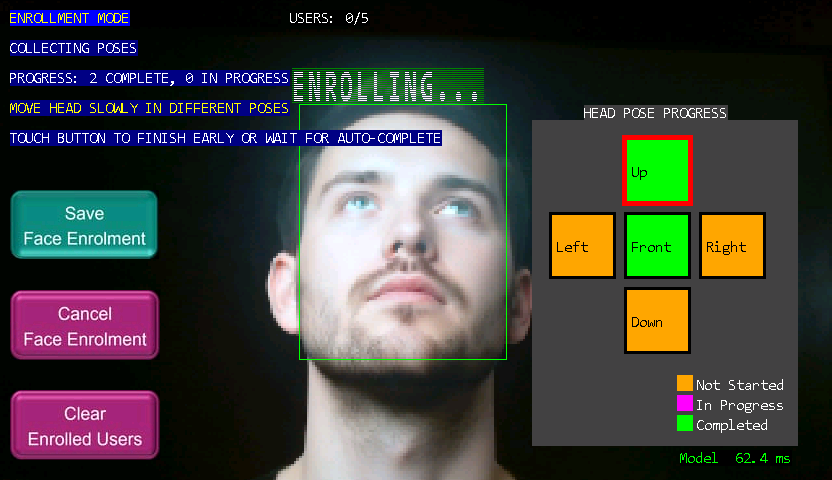

   **Figure 8. Scenario 3 : Progress: 3 completed, 0 in progress**

   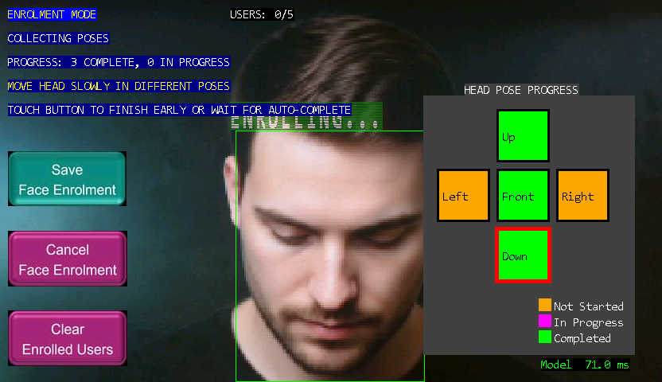

9. System will ask to adjust the pose if face is too close to edges as shown below

   **Figure 9. Face is too close to Edge**

   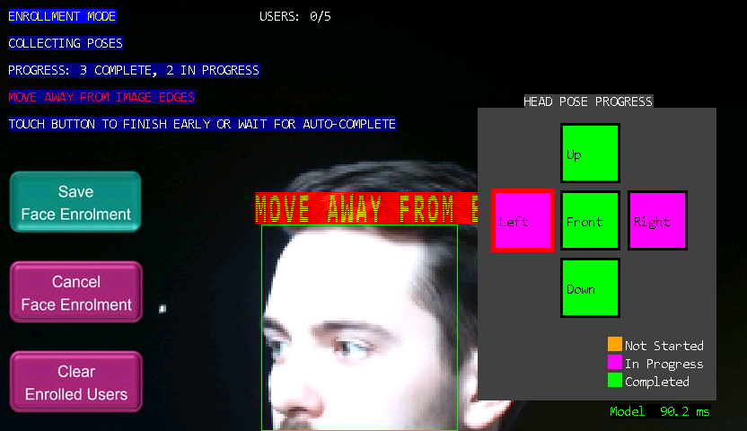

10. Once all poses are captured and all the boxes turn green, the user is automatically enrolled and redirected to the inference mode and the **User** count is incremented (e.g., **1/5**). Users also have the option to save the enrolment early once minimum 3 poses are captured by pressing the **Save Face Enrolment** button on the bottom left corner, or can abort the enrolment using the **Cancel Face Enrolment** button located below it.

11. After enrollment, when the same user’s face is detected within the camera’s field of view, the system draws a green bounding box around the face, labels it as "User_1," and shows the prediction count on the display

    **Figure 10. image of enrolled user with detection**

    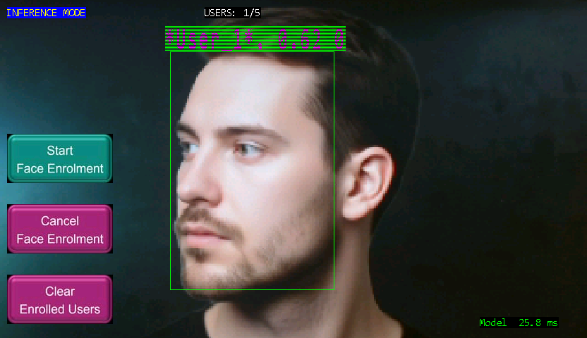

    The terminal output after completing user enrolment should appear as shown in the image below.

    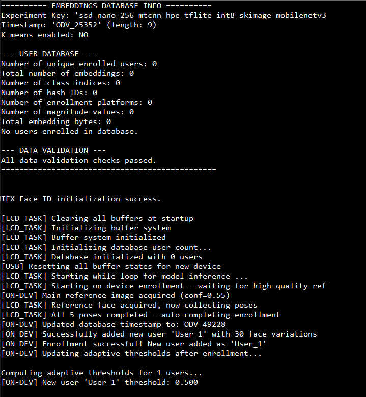
    

12. Up to five users can be enrolled. Whenever an enrolled face is detected, the system draws a bounding box around the face and displays the corresponding user number label (e.g., User_1 to User_5)

13. Enrollment data is stored persistently in non-volatile memory. After unplugging and plugging the kit back in, the system recognizes detected faces using the stored embeddings and draws a bounding box labeled with the corresponding user number

14. The last button, **Clear Enrolled Users**, removes all enrolled users and resets the user count and same is reflected on the upper panel

## Related resources

Resources  | Links
-----------|----------------------------------
Application notes  | [AN235935](https://www.infineon.com/AN235935) – Getting started with PSOC&trade; Edge E8 MCU on ModusToolbox&trade; software   [AN239191](https://www.infineon.com/AN239191) – Getting started with graphics on PSOC&trade; Edge MCU
Code examples  | [Using ModusToolbox&trade;](https://github.com/Infineon/Code-Examples-for-ModusToolbox-Software) on GitHub
Device documentation | [PSOC&trade; Edge MCU datasheets](https://www.infineon.com/products/microcontroller/32-bit-psoc-arm-cortex/32-bit-psoc-edge-arm#documents)   [PSOC&trade; Edge MCU reference manuals](https://www.infineon.com/products/microcontroller/32-bit-psoc-arm-cortex/32-bit-psoc-edge-arm#documents)
Development kits | Select your kits from the [Evaluation board finder](https://www.infineon.com/cms/en/design-support/finder-selection-tools/product-finder/evaluation-board)
Libraries  | [mtb-dsl-pse8xxgp](https://github.com/Infineon/mtb-dsl-pse8xxgp) – Device support library for PSE8XXGP   [retarget-io](https://github.com/Infineon/retarget-io) – Utility library to retarget STDIO messages to a UART port
Tools  | [ModusToolbox&trade;](https://www.infineon.com/modustoolbox) – ModusToolbox&trade; software is a collection of easy-to-use libraries and tools enabling rapid development with Infineon MCUs for applications ranging from wireless and cloud-connected systems, edge AI/ML, embedded sense and control, to wired USB connectivity using PSOC&trade; Industrial/IoT MCUs, AIROC&trade; Wi-Fi and Bluetooth&reg; connectivity devices, XMC&trade; Industrial MCUs, and EZ-USB&trade;/EZ-PD&trade; wired connectivity controllers. ModusToolbox&trade; incorporates a comprehensive set of BSPs, HAL, libraries, configuration tools, and provides support for industry-standard IDEs to fast-track your embedded application development

 

## Other resources

Infineon provides a wealth of data at [www.infineon.com](https://www.infineon.com) to help you select the right device, and quickly and effectively integrate it into your design.

## Document history

Document title: *CE242187* – *PSOC&trade; Edge MCU: Machine learning - face ID demo*

 Version | Description of change
 ------- | ---------------------
 1.0.0   | GitHub release
 

All referenced product or service names and trademarks are the property of their respective owners.

The Bluetooth&reg; word mark and logos are registered trademarks owned by Bluetooth SIG, Inc., and any use of such marks by Infineon is under license.

PSOC&trade;, formerly known as PSoC&trade;, is a trademark of Infineon Technologies. Any references to PSoC&trade; in this document or others shall be deemed to refer to PSOC&trade;.

---------------------------------------------------------

© Cypress Semiconductor Corporation, 2024-2025. This document is the property of Cypress Semiconductor Corporation, an Infineon Technologies company, and its affiliates ("Cypress").  This document, including any software or firmware included or referenced in this document ("Software"), is owned by Cypress under the intellectual property laws and treaties of the United States and other countries worldwide.  Cypress reserves all rights under such laws and treaties and does not, except as specifically stated in this paragraph, grant any license under its patents, copyrights, trademarks, or other intellectual property rights.  If the Software is not accompanied by a license agreement and you do not otherwise have a written agreement with Cypress governing the use of the Software, then Cypress hereby grants you a personal, non-exclusive, nontransferable license (without the right to sublicense) (1) under its copyright rights in the Software (a) for Software provided in source code form, to modify and reproduce the Software solely for use with Cypress hardware products, only internally within your organization, and (b) to distribute the Software in binary code form externally to end users (either directly or indirectly through resellers and distributors), solely for use on Cypress hardware product units, and (2) under those claims of Cypress's patents that are infringed by the Software (as provided by Cypress, unmodified) to make, use, distribute, and import the Software solely for use with Cypress hardware products.  Any other use, reproduction, modification, translation, or compilation of the Software is prohibited.
 
TO THE EXTENT PERMITTED BY APPLICABLE LAW, CYPRESS MAKES NO WARRANTY OF ANY KIND, EXPRESS OR IMPLIED, WITH REGARD TO THIS DOCUMENT OR ANY SOFTWARE OR ACCOMPANYING HARDWARE, INCLUDING, BUT NOT LIMITED TO, THE IMPLIED WARRANTIES OF MERCHANTABILITY AND FITNESS FOR A PARTICULAR PURPOSE.  No computing device can be absolutely secure.  Therefore, despite security measures implemented in Cypress hardware or software products, Cypress shall have no liability arising out of any security breach, such as unauthorized access to or use of a Cypress product. CYPRESS DOES NOT REPRESENT, WARRANT, OR GUARANTEE THAT CYPRESS PRODUCTS, OR SYSTEMS CREATED USING CYPRESS PRODUCTS, WILL BE FREE FROM CORRUPTION, ATTACK, VIRUSES, INTERFERENCE, HACKING, DATA LOSS OR THEFT, OR OTHER SECURITY INTRUSION (collectively, "Security Breach").  Cypress disclaims any liability relating to any Security Breach, and you shall and hereby do release Cypress from any claim, damage, or other liability arising from any Security Breach.  In addition, the products described in these materials may contain design defects or errors known as errata which may cause the product to deviate from published specifications. To the extent permitted by applicable law, Cypress reserves the right to make changes to this document without further notice. Cypress does not assume any liability arising out of the application or use of any product or circuit described in this document. Any information provided in this document, including any sample design information or programming code, is provided only for reference purposes.  It is the responsibility of the user of this document to properly design, program, and test the functionality and safety of any application made of this information and any resulting product.  "High-Risk Device" means any device or system whose failure could cause personal injury, death, or property damage.  Examples of High-Risk Devices are weapons, nuclear installations, surgical implants, and other medical devices.  "Critical Component" means any component of a High-Risk Device whose failure to perform can be reasonably expected to cause, directly or indirectly, the failure of the High-Risk Device, or to affect its safety or effectiveness.  Cypress is not liable, in whole or in part, and you shall and hereby do release Cypress from any claim, damage, or other liability arising from any use of a Cypress product as a Critical Component in a High-Risk Device. You shall indemnify and hold Cypress, including its affiliates, and its directors, officers, employees, agents, distributors, and assigns harmless from and against all claims, costs, damages, and expenses, arising out of any claim, including claims for product liability, personal injury or death, or property damage arising from any use of a Cypress product as a Critical Component in a High-Risk Device. Cypress products are not intended or authorized for use as a Critical Component in any High-Risk Device except to the limited extent that (i) Cypress's published data sheet for the product explicitly states Cypress has qualified the product for use in a specific High-Risk Device, or (ii) Cypress has given you advance written authorization to use the product as a Critical Component in the specific High-Risk Device and you have signed a separate indemnification agreement.
 
Cypress, the Cypress logo, and combinations thereof, ModusToolbox, PSoC, CAPSENSE, EZ-USB, F-RAM, and TRAVEO are trademarks or registered trademarks of Cypress or a subsidiary of Cypress in the United States or in other countries. For a more complete list of Cypress trademarks, visit www.infineon.com. Other names and brands may be claimed as property of their respective owners.