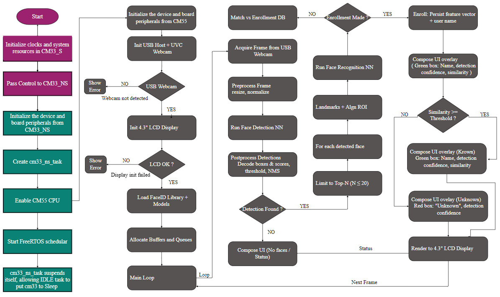

[Click here](../README.md) to view the README.

## Design and implementation

This code example supports following display and cameras:

- **[Waveshare 4.3-inch Raspberry Pi DSI LCD Display](https://www.waveshare.com/4.3inch-dsi-lcd.htm):** The LCD houses a Chipone ICN6211 display controller and uses the MIPI DSI interface
- **[HBVCAM OV7675 0.3MP Camera](https://www.hbvcamera.com/0-3mp-pixel-usb-cameras/hbvcam-ov7675-0.3mp-mini-laptop-camera-module.html)**
- **[HBVCAM OS02F10 2MP Camera](https://www.hbvcamera.com/2-mega-pixel-usb-cameras/2mp-1080p-auto-focus-hd-usb-camera-module-for-atm-machine.html)**
- **[Logitech C920 HD Pro Webcam](https://www.logitech.com/en-ch/shop/p/c920-pro-hd-webcam)**

All PSOC&trade; Edge E84 MCU applications have a dual-CPU three-project structure to develop code for the CM33 and CM55 cores. The CM33 core has two separate projects for the secure processing environment (SPE) and non-secure processing environment (NSPE). A project folder consists of various subfolders, each denoting a specific aspect of the project. The three project folders are as follows:

**Table 1. Application projects**

Project | Description
--------|------------------------
*proj_cm33_s* | Project for CM33 secure processing environment (SPE)
*proj_cm33_ns* | Project for CM33 non-secure processing environment (NSPE)
*proj_cm55* | CM55 project

 

In this code example, at device reset, the secure boot process starts from the ROM boot with the secure enclave (SE) as the root of trust (RoT). From the secure enclave, the boot flow is passed on to the system CPU subsystem where the secure CM33 application starts. After all necessary secure configurations, the flow is passed on to the non-secure CM33 application. Resource initialization for this example is performed by this CM33 non-secure project. It configures the system clocks, pins, clock to peripheral connections, and other platform resources. It then enables the CM55 core using the `Cy_SysEnableCM55()` function and allows Idle task to put CM33 in DeepSleep mode.

In the CM55 application, the clocks and system resources are initialized by the BSP initialization function. The retarget-io middleware is configured to use the debug UART. The debug UART prints a message as shown in the Terminal output on program startup. The onboard KitProg3 acts the USB-UART bridge to create the virtual COM port.

Following are a few important components of this code example:

- **_proj_cm55/usb_camera_task.c/.h_:** This file contains the handling of the USB webcam and USB host callbacks and asssociated data. This is vital for ensuring that the graphics thread has image data to display as well as run FaceID predictions on.
- **_proj_cm55/lcd_task.c/.h_:**  This file contains handles and utilizes the graphics subsystem and FaceID libaries to draw a 2D vectored predictions to the display. This is also responsible for initializing and calling any faceID APIs to get the proper results to display.
- **_Application code_:** The "main" function  (**proj_cm55/main.c**) first initializes the BSP. After that it performs the retarget-io intialization to use the debug UART port. Next it will ensure all PSRAM is initialized for holding graphics data. Once that is done it creates **cm55_ns_gfx_task** and **cm55_usb_webcam_task** FreeRTOS tasks. Before starting the FreeRTOS scheduler, the main function prints "PSOC Edge MCU: Machine learning - face ID demo" on the debug terminal.
**cm55_ns_gfx_task** performs the LCD panel and VGLite initialization along with NN inference on incoming frame data. It creates the VGLite buffers and sets up the identity matrix. Once all the initializations are completed, this task invokes the **getInputImage** function in to obtain captured image data from the USB webcam. FPS statistics data is regularly displayed on the UART terminal.
On the other hand, **cm33_ns_task** freeRTOS task puts the CM33 CPU to DeepSleep mode.

**Figure 1. Code flow chart**

 